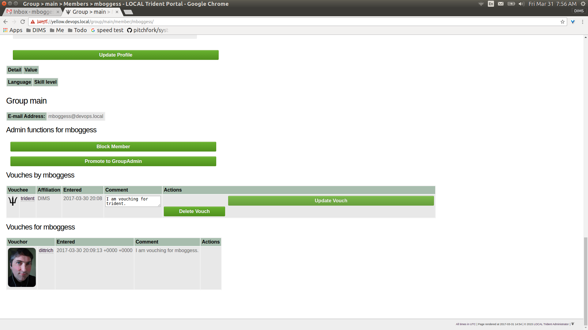
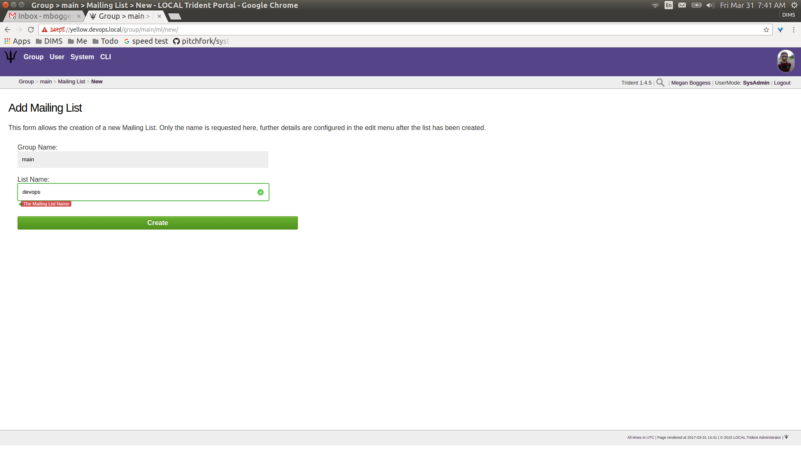

.. _grouplifecycle:

Trust Group Administration Activities
=====================================

This chapter serves as a training guide for people who will
be administering and managing trust groups using a Trident
portal system.  It includes activities such as setting
trust group policies for vetting, vouching, and idle
timeouts, resetting user passwords, adding users manually,
and more. Only trust group administrator members are allowed
to view or manage these tasks. 

.. _adminuseractivities:

Admin Password Reset
~~~~~~~~~~~~~~~~~~~~

There is one user-related activity that only a trust group
administrator can manage: initiating the reset of a password
for another user (Figure :ref:`userAdminPasswordReset`). Make sure
to confirm via the toggle before clicking the ``Request
Password reset`` button.

.. _userAdminPasswordReset:

       Admin password reset for user

..

An admin can only begin the process for resetting a user's
password, she cannot do it directly. Each user was initially
nominated to the trust group before being allowed membership
in the trust group. The nominator of a user is part of the
process to reset a user's password. As such, because none of
the users in our example group were nominated (nor have any
of the users uploaded PGP keys), this activities fails
(Figure :ref:`userAdminPasswordResetFail`). Once all members have
uploaded keys and there are members who have been nominated,
this activity can continue. 

.. _userAdminPasswordResetFail:

       Admin password reset fail

..

.. todo::

    Get PGP keys uploaded and add a member through
    nomination so this activity can be fully documented?

..

.. _groupadminactivities:

Group Admin Activities
~~~~~~~~~~~~~~~~~~~~~~

This section describes the group-related activities
manageable only by trust group administrators. These
activities include adding new mailing lists to a trust
group, adding a new trust group, updating the group's
settings and adding modules to the group, and a couple
member-related actions.

When logged in as a trust group administrator, the ``Group`` 
home page looks like what is shown in Figure :ref:`groupHomePage`).

.. _groupHomePage:

       Group home, sysadmin

..

To add a new trust group, click the ``Add Group`` link in
the second row at the top of the page
(Figure :ref:`groupAddNewGroup`). This opens a new page with a field
for the new trust group's name. Fill in the field, then click
the ``Create`` button.

.. _groupAddNewGroup:

       Add group

..

This opens a new page with settings for the new group
(Figure :ref:`groupNewGroupSettingsTop`). Configure these settings
as needed and, if any modifications are made, click the
``Update Group`` button at the bottom of the page
(Figure :ref:`groupNewGroupSettingsBottom`).

.. _groupNewGroupSettingsTop:

       New group settings, top

..

.. _groupNewGroupSettingsBottom:

       New group settings, bottom

..

Returning to the ``Group`` home page, the new group will be
added in the list of links to current trust groups of which
the current user is a member (Figure :ref:`groupHomePageUpdated`).

.. _groupHomePageUpdated:

       Group home page, updated

..

Once a trust group exists, changes can be made to it or to
its members. A specific group's home page might look like
the page shown in Figure :ref:`groupMain`.

.. _groupMain:

       "Main" group's home page

..

This page contains almost exactly the same set of links on
the page itself or tabs in the second row at the top of the
page. The ``Settings`` link and tab can now be seen. Group
settings include vouching policies, timeout policies, idle
policies, PGP requirement policy, and including additional
modules (not yet added in Figure :ref:`groupSettingsTop`).

.. _groupSettingsTop:

       Group settings, top

..

.. _groupSettingsBottom:

       Group settings, bottom

..

There are three additional modules that are option to the
use of a Trident portal system and may be added at any time:
the Wiki module, the Files module, and the Calendar module. 

.. note::

    At this time, the Calendar module seems to still be
    under development. Toggling "on" the Calendar module in
    group settings does not add a Calendar link or tab. We
    are reporting this to the Trident developers.

..

To view potential modules to add, go to the current trust
group's ``Settings`` page. If a module has not been added,
its toggle will not be in the "on" position (highlighted and
the toggle moved to the right), as can be seen in the page
shown in Figure :ref:`groupModulesAddOff`.

.. _groupModulesAddOff:

       Group modules off

..

To add modules, toggle each desired module to the "on"
position as shown in Figure :ref:`groupModulesAddOn`.

.. _groupModulesAddOn:

       Group modules on

..

Make sure to click the ``Update Group`` button at the bottom
of the ``Settings`` page. From the ``Settings`` page, links
for the newly-added modules will appear in the second row of
links at the top of the page, as can be seen in the page
shown in Figure :ref:`groupModulesAdded`. Returning to the
group's home page would show links for the modules in the
list of links.

.. _groupModulesAdded:

       Group modules added

..

The ``Member`` page changes slightly when a user has trust
group administration privileges (Figure
:ref:`groupMemberActions`). A new column is added,
``Actions``, to the list of trust group members and
information. These actions allow the administrator to block
or unblock a member and demote or promote a group
administrator. These are accomplished through the buttons
found in the ``Actions`` column.

.. _groupMemberActions:

       Group member admin actions

..

Thes actions (blocking/unblocking and demoting/promoting)
are also available on each trust group member's profile.
Click the member's link from the list on the ``Members`` page
to go to the member's profile (Figure
:ref:`groupMemberProfileTop`).

.. _groupMemberProfileTop:

       Group member profile, top

..

Scroll down towards the bottom of the profile until just
before the vouching section of the profile. There is a
section titled ``Admin functions`` for a given user. This
section contains the same buttons to block or unblock and
demote or promote as can be found in the ``Actions`` column
on the member page (Figure :ref:`groupMemberProfileBottom`).

.. _groupMemberProfileBottom:

       Group member profile, bottom

..

Finally, trust group administrators can add and delete mailing
lists. To see a list of current mailing lists, from a trust
group's main page, navigate to the ``Mailing List`` page
using either the link on the page or the tab in the second
row at the top of the page. The list can be seen on the page
shown by Figure :ref:`groupMailingListList`.

.. _groupMailingListList:

       Mailing lists list

..

Now, the second row of tabs at the top of the page has
changed to just one, ``New Mailing List``. Click this tab to
go to a new page to add a new mailing list. Fill in a name
for the mailing list in the required field as shown in
Figure :ref:`groupMailingListNewList`. Then click the
``Create`` button.

.. _groupMailingListNewList:

       Add new mailing list

..

Clicking the ``Create`` button immediately opens the
``Settings`` page (Figure :ref:`groupMailingListSettings`)
for the new mailing list. Modify the settings as needed, and
click the ``Update Configuration`` button.

.. _groupMailingListSettings:

       Mailing list settings

..

Returning to the ``Mailing List`` home page, the new mailing
list has been added to the list, as can be seen in the page
shown by Figure :ref:`groupMailingListUpdatedList`.

.. _groupMailingListUpdatedList:

       Updated list of mailing lists

..

A ``Settings`` page is available for all mailing lists.
In the list on the ``Mailing List`` page (see Figure
:ref:`groupMailingListUpdatedList`), there are links in
the ``Shortname`` column. Clicking this link opens a new page
with a list of current mailing list members and tabs in the
second row at the top of the page (Figure
:ref:`groupMailingListMembers`) for the ``Settings`` page
(Figure :ref:`groupMailingListSettings`), to ``Subscribe``
or ``Unsubscribe`` the current user to or from the mailing
list, and to download PGP keys for the current mailing list.

.. _groupMailingListMembers:

       Mailing list members

..

Click the ``Subscribe`` or ``Unsubscribe`` tabs to subscribe
or unsubscribe the current member from the current mailing
list. Click the ``PGP Key`` tab to download the PGP keys for
the current mailing list.

These actions can also be completed from the ``Mailing
List`` home page (Figure :ref:`groupMailingListActivitiesList`).

.. _groupMailingListActivitiesList:

.. figure:: images/trident/group-admin-shots/group-mailing-list-activities-list.png
       :width: 85%
       :align: center

       Mailing list activities

..

For the desired mailing list, click the link ``PGP Key`` in
the ``PGP`` column to download the PGP key for that mailing
list. To unsubscribe or subscribe to a mailing list, click
the available button in the ``Action``
column.

This concludes the activities manageable by a trust group
administrator. To see tasks for regular members of trust
groups or for system administrators, please see the other
chapters in this document (Section :ref:`memberlifecycle`
and Section :ref:`systemadministration`, respectively).
