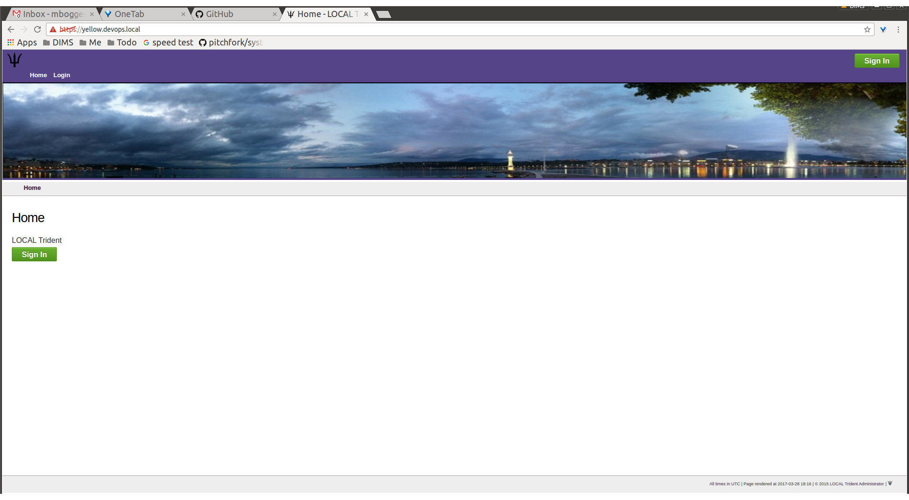
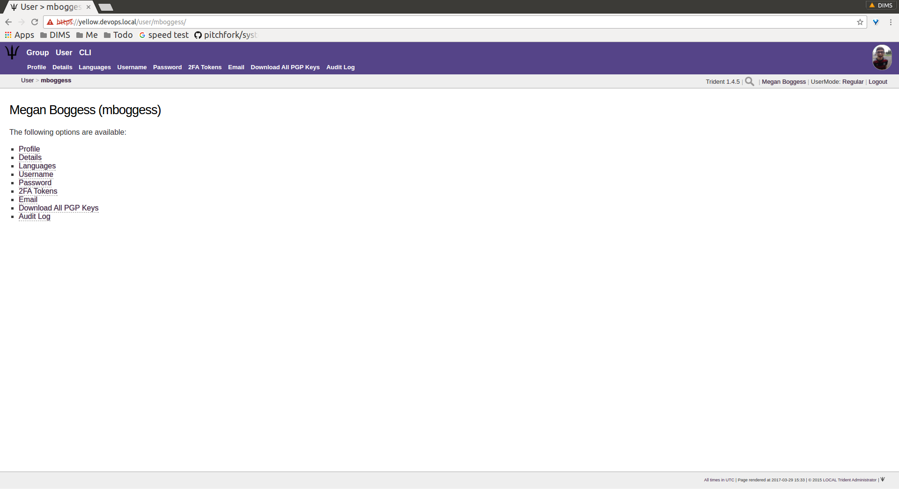

.. _introduction:

Introduction 
============

.. todo::

   Introduce this better.

..

.. _documentOverview:

Document Overview
~~~~~~~~~~~~~~~~~

The remainder of this document is divided into chapters
that are focused on specifics needed by as follows:

+ Section :ref:`memberlifecycle` guides members through
  activities and attributes they can manage.

+ Section :ref:`grouplifecycle` guides trust group admins
  though activities and attributes they can manage.

+ Section :ref:`systemadministration` guides system admins
  through activities and attributes they can manage.

Each of these groups of activities requires logging in to
Trident, so the remainder of this section covers this
initial basic task.

.. _loggingIn:

Logging in to Trident
~~~~~~~~~~~~~~~~~~~~~

In order to do anything in Trident, you must be logged in.
This can be done at the command line, or through the web
application using a web browser. The latter is described in
In a web browser, navigate to the URL of the Trident
system. The following page should appear:

.. _tridentHomePage:

       Trident home page

..

Click one of the ``Sign In`` buttons to go to the login
page:

.. figure:: images/trident/trident-login-page.png
       :width: 85%
       :align: center

       Trident login page

..

Enter your credentials, and click the ``Sign In`` button.
This will bring you to your user's home page, which will
look similarly to this page:

       User logged in

..

