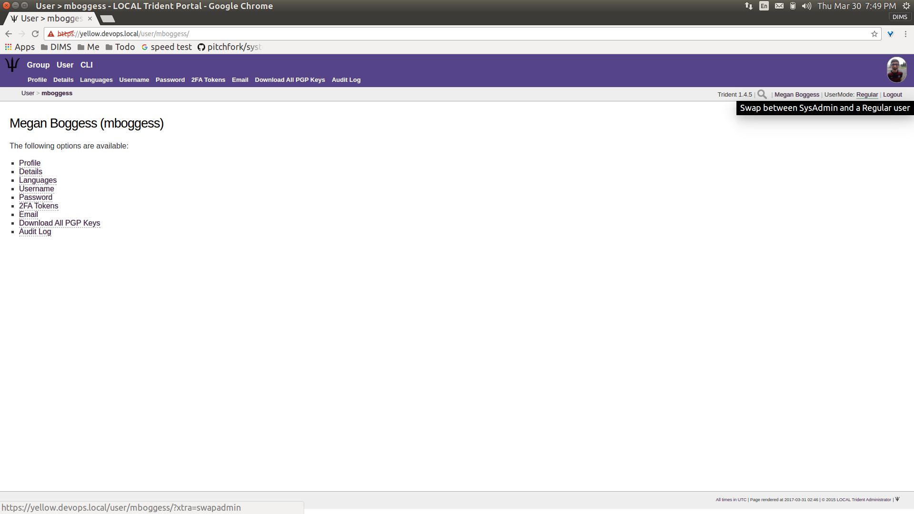
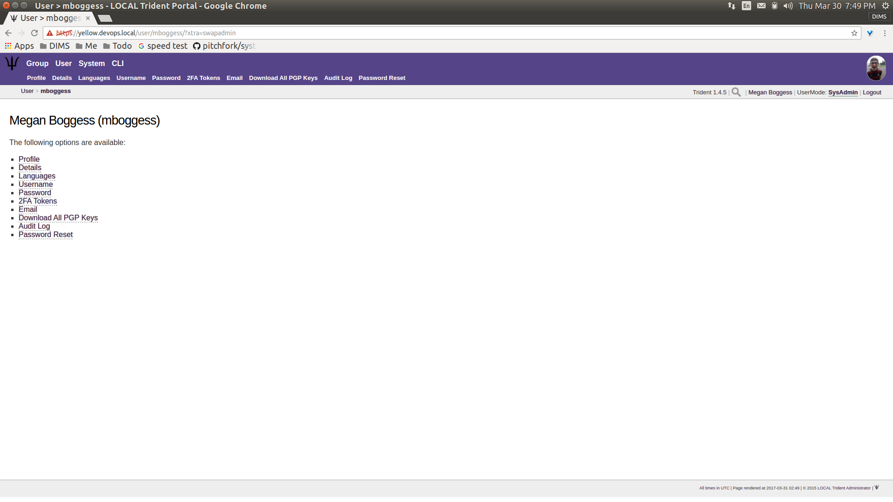

.. _introduction:

Introduction
============

.. todo::

   Introduce this better.

..

.. _documentOverview:

Document Overview
~~~~~~~~~~~~~~~~~

The remainder of this document is divided into chapters
that are focused on specifics needed by as follows:

+ Section :ref:`memberlifecycle` guides members through
  activities and attributes they can manage.

+ Section :ref:`grouplifecycle` guides trust group admins
  though activities and attributes they can manage.

+ Section :ref:`systemadministration` guides system admins
  through activities and attributes they can manage.

Each of these groups of activities requires logging in to
Trident, so the remainder of this section covers this
initial basic task.

.. _loggingIn:

Logging in to Trident
~~~~~~~~~~~~~~~~~~~~~

In order to do anything in Trident, authentication is required.  This can be
done at the command line, or through the web application using a web browser.

.. note::

   This section only covers authentication and actions
   using the web application user interface. For details
   of command line use, see examples in
   Section :ref:`systemadministration`.

In a web browser, navigate to the URL of the Trident system.
A page similar to the one shown in Figure
:ref:`tridentHomePage` should open.

.. _tridentHomePage:

.. figure:: images/trident/trident-home-page.png
       :width: 85%
       :align: center

       Trident home page

..

Click one of the ``Sign In`` buttons to go to the login
page (Figure :ref:`tridentLoginPage`).

.. _tridentLoginPage:

.. figure:: images/trident/trident-login-page.png
       :width: 85%
       :align: center

       Trident login page

..

Enter your credentials, and click the ``Sign In`` button.
This will bring you to your user's home page, which will
look similarly to Figure :ref:`tridentUserLoggedIn`.

.. _tridentUserLoggedIn:

.. figure:: images/trident/user-logged-in.png
       :width: 85%
       :align: center

       User logged in

..

In the top right corner, below the user's image, are some
smaller links. These show the current Trident version, the
current user, the logout link, and the ``UserMode``. It
initially indicates the ``UserMode`` is ``Regular`` or not an
admin user. To "swap" to being an admin user, click the
``UserMode`` link (:ref:`userSwapadminRegular`).

.. _userSwapadminRegular:

       User swapadmin, regular

..

This will swap the user into ``SysAdmin`` mode
(:ref:`userSwapadminAdmin`). This does not necessarily mean
the user is a system administrator, though it may. It does
mean the user is now, at the least, a trust group
administrator.

.. _userSwapadminAdmin:

       User swapadmin, admin

..

