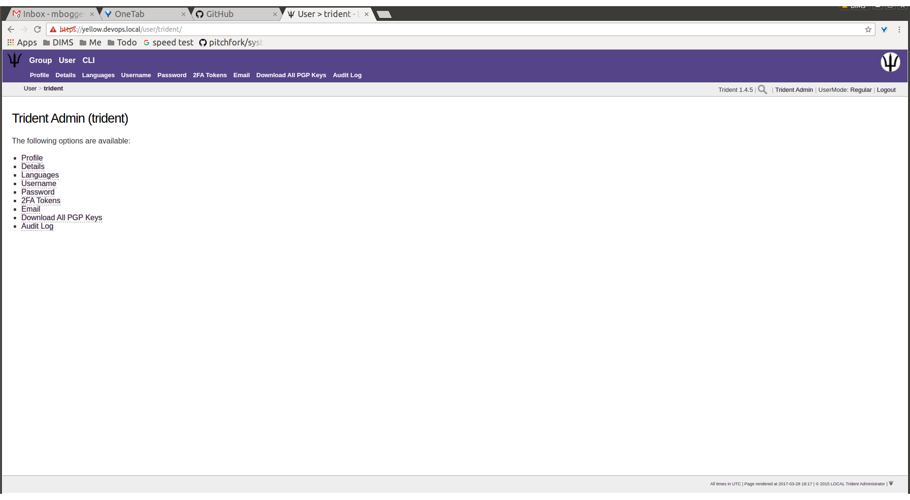

.. _memberlifecycle:

Lifecycle of a Trident Member
=============================

Introduction
------------

This chapter serves as a training guide for members of a
trust group using a Trident user portal system. It clearly
shows what activities a member may pursue and attributes he
or she may manage. These activities include updating a
member's profile and other personal details, managing
mailing list memberships, using the wiki, etc.

Logging in to Trident
---------------------

In order to manage a member of a Trident trust group, you
must have access to a running Trident system. Navigate in
your web browser to the URL of the system to which you
have access. That will bring you to the following page:

.. figure:: images/trident/trident-home-page.png
       :width: 85%
       :align: center

       Trident home page

..

Click one of the ``Sign In`` buttons to bring you to the
login page:

.. figure:: images/trident/trident-login-page.png
       :width: 85%
       :align: center

       Trident login page

..

Enter your credentials, and click the ``Sign In`` button.
This will bring you to your user's home page, which will
look similarly to this page:

       Trident user logged in

..

User Management
---------------

This section will cover management of a user's attributes.

Profile Management
~~~~~~~~~~~~~~~~~~

.. todo::

    This will be dedicated to the ``Profile`` tab.

..

Other Personal Details
~~~~~~~~~~~~~~~~~~~~~~

.. todo::

    This will cover the ``Details``, ``Languages``, and
    ``Username`` tabs.

..

Password Reset
~~~~~~~~~~~~~~

.. todo::

    This will cover the ``Password`` tab.

..

Two Factor Authentication
~~~~~~~~~~~~~~~~~~~~~~~~~

.. todo::

    This will cover the ``2FA Tokens`` tab.

..

Email Management
~~~~~~~~~~~~~~~~

.. todo::

    This will cover the ``Email`` tab.

..

PGP Keys
~~~~~~~~

.. todo::

    This will cover the ``Download All PGP Keys`` tab,
    as well as how to upload PGP keys.

..

Audit Log
~~~~~~~~~

.. todo::

    This will cover the ``Audit Log`` tab.

..

Group Management
----------------

This section will cover group attributes a user may manage
or view.

Viewable Group Attributes
~~~~~~~~~~~~~~~~~~~~~~~~~

.. todo::

    This will cover the ``Member``, ``Airports``, ``Contacts``
    and ``Vouches`` tab.

..

Manageable Group Attributes
~~~~~~~~~~~~~~~~~~~~~~~~~~~

.. todo::

    This will cover the ``PGP Keys``, ``Mailing List``
    ``Wiki``, ``Files``, ``Nominate``, and ``Vouching
    Control Panel`` tabs.

..

