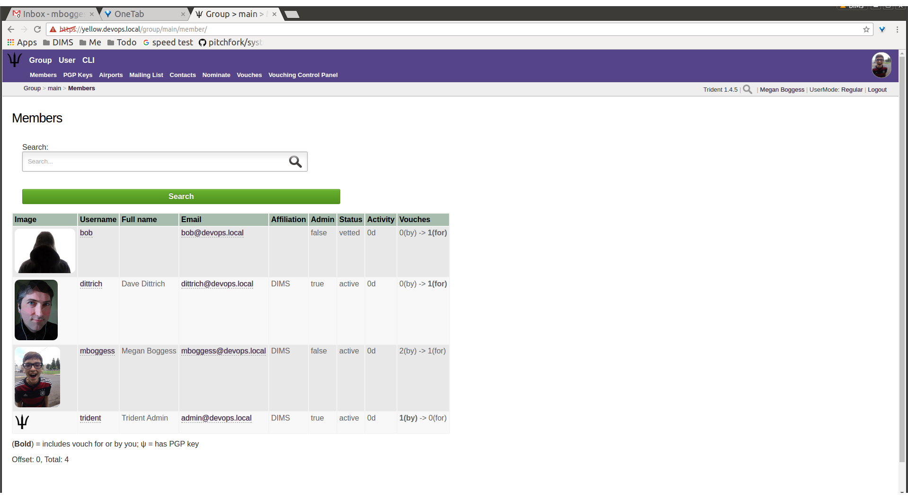

.. _memberlifecycle:

Trust Group Member Activities
=============================

This chapter serves as a training guide for members of a
trust group using a Trident portal system. It clearly
shows what activities a member may pursue and attributes she
may manage. These activities include updating a member's
profile and other personal details, managing mailing list
memberships, using the wiki, etc.

.. _usermanagement:

User Management
~~~~~~~~~~~~~~~

This section will cover management of a user's attributes.
While most (if not all) of the time, a user of the Trident
portal system will be a member of a trust group, a user can
exist without being a member. This section covers actions
any user or member can take. Thus, the words "user" and
"member" are used interchangeably. It should be noted, there are
actions which only a user who is also a trust group member
can take. These actions are covered in Section
:ref:`usergroupmanagement`.

.. _userprofilemanagement:

Profile Management
------------------

Most of the details a regular member of a trust group can
modify about himself are found in the ``Profile`` page.
This page is accessible by clicking the ``Profile`` tab in
the second row of links at the top of the page from most
user-related pages, or the ``Profile`` link in the list of
links on the user's home page. Click either of those to get
to the ``Profile`` page that has editable attributes. The
profile can be seen in Figures :ref:`userProfileTop`,
:ref:`userProfileMiddle`, and :ref:`userProfileBottom`.

.. _userProfileTop:

.. figure:: images/trident/user-regular-shots/user-profile-1.png
       :width: 85%
       :align: center

       User profile, top

..

.. _userProfileMiddle:

.. figure:: images/trident/user-regular-shots/user-profile-2.png
       :width: 85%
       :align: center

       User profile, middle

..

.. _userProfileBottom:

.. figure:: images/trident/user-regular-shots/user-profile-3.png
       :width: 85%
       :align: center

       User profile, bottom

..

On the profile page, details such as name, affiliation,
address, phone number, and airport can be added or modified.
A profile image can be uploaded. Longer-form attributes
can be edited, such as postal details and biography. Failed
logins and some activity statistics are also tracked on a
member's profile.

Click the ``Update Profile`` button to save the changes
after modifications have been made. The page will
refresh with the newly saved information, as well as indicate
how many fields were updated and how many fields were not
updated.

.. _userotherdetails:

Other Personal Details
----------------------

Other personal details can be modified through the ``Details``,
``Languages``, and ``Username`` tabs found in the second row
at the top of any user-related page or in the list of links
found on a user's home page. This section covers these
actions.

The ``Details`` page (Figure :ref:`userDetails`) is a place to add
any other details that don't conform to the profile.
Currently, the only detail type is a callsign.

.. _userDetails:

.. figure:: images/trident/user-regular-shots/user-details.png
       :width: 85%
       :align: center

       User details

..

The ``Languages`` page (Figure :ref:`userLanguageChoose`) is the
place to add languages a member knows and her skill level
(Figure :ref:`userLanguageSkill`) at that language. Click the
``Add Language`` button to add a new language
(Figure :ref:`userLanguageUpdated`).

.. _userLanguageChoose:

.. figure:: images/trident/user-regular-shots/user-languages-1.png
       :width: 85%
       :align: center

       User languages, choose language

..

.. _userLanguageSkill:

.. figure:: images/trident/user-regular-shots/user-languages-2.png
       :width: 85%
       :align: center

       User languages, choose skill level

..

.. _userLanguageUpdated:

.. figure:: images/trident/user-regular-shots/user-languages-3.png
       :width: 85%
       :align: center

       User languages, updated language

..

The ``Username`` page (Figure :ref:`userUsername`) allows a member
to change her username.  This can affect external systems,
so this change should be used with care and caution. Enter
the new username in the field and use the toggle to confirm
the change before clicking the ``Change username`` button.

.. _userUsername:

.. figure:: images/trident/user-regular-shots/user-username.png
       :width: 85%
       :align: center

       User username change

..

.. _userpasswordchange:

Password Change
---------------

The ``Password`` page (Figure :ref:`userPasswordChange`) allows a
member to change her password, provided she knows her current
password (which she should, since she is logged in already).
When the member clicks the ``Change Password`` button, she
is immediately logged out and must login again with the new
password (Figure :ref:`userPasswordLogin`).

.. _userPasswordChange:

.. figure:: images/trident/user-regular-shots/user-password-change-1.png
       :width: 85%
       :align: center

       Define new password

..

.. _userPasswordLogin:

.. figure:: images/trident/user-regular-shots/user-password-change-2.png
       :width: 85%
       :align: center

       Login with new password

..

.. _user2famanagement:

Two Factor Authentication
-------------------------

The ``2FA Tokens`` page (Figure :ref:`user2FA`) allows a member to
add two-factor authentication tokens. Types of two-factor
authentications include a variety of one-time passwords:
time-based, HMAC-based, and single-use. The user must give
his current password and a description for the token, as
well as choose which OTP type. Once those fields have been
filled out, click the ``Create`` button, and the new token
will show in the list of two-factor authentication tokens.

.. _user2FA:

.. figure:: images/trident/user-regular-shots/user-2FA.png
       :width: 85%
       :align: center

       Two-factor authentication

..

.. _useremailmanagement:

Email Management
----------------

The ``Email`` page (Figure :ref:`userMainEmail`) covers a variety
of things. It lists email addresses tied to a user's
account, showing if each email address has a PGP key tied to
it, whether it is verified, whether it is the recovery email
address associated with the user's account, and with which
trust group it will be used.  This page also provides a way
to add a new email address, and lists each group and
associated email addresses for that group.

.. note::

    Encryption keys are discussed in Section :ref:`pgpKeys`.

..

.. _userMainEmail:

.. figure:: images/trident/user-regular-shots/user-email-1.png
       :width: 85%
       :align: center

       Main email page

..

A user can edit (Figure :ref:`userEmailEdit`) attributes about
email addresses associated with his account by clicking the
``Edit`` button in the row of the email address for which
the edits should be made.

.. _userEmailEdit:

.. figure:: images/trident/user-regular-shots/user-email-2.png
       :width: 85%
       :align: center

       Email edit page

..

Click the ``Make Recover Email`` button to make the
selected email address the recovery email address for the
user's account.

Once this is completed, the button disappears and a check
box appears in the ``Recover`` row (Figure :ref:`userEmailRecover`).

.. _userEmailRecover:

.. figure:: images/trident/user-regular-shots/user-email-3.png
       :width: 85%
       :align: center

       Make recover email

..

As can be seen, this is also the page where PGP keys are
to be added, and we will cover this in the next section.

Going back to the ``Email`` page shows another check box
in the list of email address (Figure :ref:`userConfirmRecover`).

.. _userConfirmRecover:

.. figure:: images/trident/user-regular-shots/user-email-4.png
       :width: 85%
       :align: center

       Recover email confirmed

..

To add an email address (Figure :ref:`userAddNewEmail`), type it
in the requested field:

.. _userAddNewEmail:

.. figure:: images/trident/user-regular-shots/user-email-5.png
       :width: 85%
       :align: center

       Add new email

..

After clicking the ``Add Email Address`` button, the page
will refresh with the new address in the list at the top
of the page. Click the ``Edit`` button to make additional
changes (Figure :ref:`userEmailAttributes`).

.. _userEmailAttributes:

.. figure:: images/trident/user-regular-shots/user-email-6.png
       :width: 85%
       :align: center

       New email attributes

..

A member must verify any new email addresses he manually adds.
Click the ``Verify`` button. This will send an email to the
provided address. The email will contain a verification code.
Copy and paste the code in the ``Verification Code`` field,
and click the ``Confirm`` button (Figure :ref:`userVerifyEmail`).

.. _userVerifyEmail:

.. figure:: images/trident/user-regular-shots/user-email-7.png
       :width: 85%
       :align: center

       Verify email

..

Until the email address is verified, the list of email addresses
will retain an ``In Process`` status in the ``Verify`` column
(Figure :ref:`userEmailStatus`).

.. _userEmailStatus:

.. figure:: images/trident/user-regular-shots/user-email-8.png
       :width: 85%
       :align: center

       New email status

..

.. TODO

Remember, the via "Edit" screen, an email address can be
made to be the recovery email address for an account. Only
one address may be the recovery email.

Since the ``dittrich`` user has not confirmed his new email
address yet, let's take a look at what happens when a user
does have multiple verified email addresses.

A user can choose which email address will be associated
with each trust group of which she is a member. In the case
of the user ``mboggess``, she has two email addresses. Only
one address can be associated with a trust group at a time.
Since she has two email addresses, she must chose one to
be associated with the ``main`` trust group of which she is
a member (Figure :ref:`userMultipleEmails`).

.. _userMultipleEmails:

.. figure:: images/trident/user-regular-shots/user-email-9.png
       :width: 85%
       :align: center

       Multiple emails

..

By choosing the second email address (the ``@uw`` email address)
to be the email address associated with the ``main`` trust
group, the list at the top of the page changes. It now
shows the ``@uw`` email address is associated with the ``main``
trust group, as indicated by the ``Groups`` column in the
list (Figure :ref:`userEmailGroupAssoc`).

.. _userEmailGroupAssoc:

.. figure:: images/trident/user-regular-shots/user-email-10.png
       :width: 85%
       :align: center

       Email-group association swap

..

.. _pgpKeys:

PGP Keys
--------

PGP keys can be downloaded and uploaded. They must stay
current for a user to be able to read any encrypted email
sent via the trust groups of which the user is a member.

.. note::

    For information on using PGP (or GNU Privacy Guard) keys
    for secure email communication, see the Free Software
    Foundation's `Email Self-Defense`_ guide.

..

.. _Email Self-Defense: https://emailselfdefense.fsf.org/en/

To download all PGP keys tied to any emails associated with
a user's account, just click the ``Download All PGP Keys``
tab in the second row at the top of any ``User`` page, or
click the ``Download All PGP Keys`` link in the list of
links on the user's home page (Figure :ref:`userDownloadPGPKeys`).

.. _userDownloadPGPKeys:

.. figure:: images/trident/user-regular-shots/user-pgp-download.png
       :width: 85%
       :align: center

       Download PGP keys

..

To add PGP keys, return to the ``Email`` page. Click the ``Edit``
button in the row of the email address with which a new PGP
key should be associated. In the ``PGP Key`` row, choose the
PGP key file. Then click the ``Upload Key`` button
(Figure :ref:`userUploadPGPKey`).

.. _userUploadPGPKey:

.. figure:: images/trident/user-regular-shots/user-pgp-add.png
       :width: 85%
       :align: center

       Upload PGP key

..

.. _userauditlogmanagement:

Audit Log
---------

The ``Audit Log`` page (Figure :ref:`userAuditLog`) has no editable
attributes. It shows all activities accomplished by the user.

.. _userAuditLog:

.. figure:: images/trident/user-regular-shots/user-audit-log.png
       :width: 85%
       :align: center

       Audit log

..

Searches are possible. Additionally, only 10 activities are
shown at a time, so click the ``Forward`` button to see
older activities.

.. _usergroupmanagement:

Group Management
~~~~~~~~~~~~~~~~

This section will cover group activities and attributes a
member of a trust group may view or manage. The user must
be a member of a trust group to be able to access any of
the following pages.

.. _viewableattributes:

Viewable Group Attributes
-------------------------

This subsection will cover attributes viewable from the
``Member``, ``Airports``, ``Contacts``, and ``Vouches``
tabs.

First of all, to view a list of groups of which a user is a
member, click the ``Group`` tab in the top row of any page
(Figure :ref:`userTGList`).

.. _userTGList:

.. figure:: images/trident/group-regular-shots/group-main-1.png
       :width: 85%
       :align: center

       Trust group list

..

To see more information about a certain group, click one of
the links in the list (Figure :ref:`userTGAttrList`).

.. _userTGAttrList:

.. figure:: images/trident/group-regular-shots/group-main-2.png
       :width: 85%
       :align: center

       Trust group attributes list

..

This presents a page with a list of links to all attributes
viewable or manageable by the member. There are some activities
the member may take part in, such as nominating and vouching
for new group members, but, for the most part, a regular
member may only view group attributes. Regular members are
not allowed to change attributes about the group or its
members. One notable exception is that regular members are
allowed to nominate new users to a trust group and vouch for
current members of a trust group. Nominating and vouching
will be covered in Section Figure :ref:`vouching`. For now, let's
go over the attributes viewable by members.

The first link on the group home page, or the first tab in
the second row of all group-related pages, is titled
``Members``. Click either the link or the tab to go to a
page listing all members in the current trust group
(Figure :ref:`userTGMembersList`).

.. _userTGMembersList:

.. figure:: images/trident/group-regular-shots/group-members.png
       :width: 85%
       :align: center

       Trust group members list

..

Click on any member's username link to view their profile
(Figures :ref:`userTGMemberProfileTop`,
:ref:`userTGMemberProfileMiddle`,
:ref:`userTGMemberProfileVouchesFor`).

.. _userTGMemberProfileTop:

.. figure:: images/trident/group-regular-shots/group-member-profile-1.png
       :width: 85%
       :align: center

       Member profile, top

..

.. _userTGMemberProfileMiddle:

.. figure:: images/trident/group-regular-shots/group-member-profile-2.png
       :width: 85%
       :align: center

       Member profile, middle

..

.. _userTGMemberProfileVouchesFor:

.. figure:: images/trident/group-regular-shots/group-member-profile-3.png
       :width: 85%
       :align: center

       Member profile, vouches for

..

Within a trust group, any member's profile is viewable. At
the bottom of the profile, there are lists of vouching
activities of which the current member has been a part:
vouches he has made or vouches other members have made for
him. In the above example, another user vouched for the
user ``dittrich``, but he has not yet vouched for anyone.

.. TODO

In this next example, the user ``trident`` has vouched
for another member, but has not yet been vouched for by
any other member (Figure :ref:`userTGMemberProfileVouchesMade`).

.. _userTGMemberProfileVouchesMade:

.. figure:: images/trident/group-regular-shots/group-member-profile-4.png
       :width: 85%
       :align: center

       Member profile, no vouches for

..

The ``Airports`` page (Figure :ref:`userTGAirportsList`) shows a
list of airports members of the current trust group indicate
as the airport nearest to them.

.. _userTGAirportsList:

.. figure:: images/trident/group-regular-shots/group-airports.png
       :width: 85%
       :align: center

       Airports list

..

Click on any airport abbreviation in the list, and a new
page will open with a list of members who have indicated the
airport is the airport nearest to them
(Figures :ref:`userTGAirportsPHL` and :ref:`userTGAirportsSEA`).

.. _userTGAirportsPHL:

.. figure:: images/trident/group-regular-shots/group-airports-phl.png
       :width: 85%
       :align: center

       Members with PHL airport

..

.. _userTGAirportsSEA:

.. figure:: images/trident/group-regular-shots/group-airports-sea.png
       :width: 85%
       :align: center

       Members with SEA airport

..

The ``Contacts`` page (Figure :ref:`userTGContactList`) shows a list
of members of the current trust group with their contact
information, including affiliation, email, telephone, and SMS.

.. _userTGContactList:

.. figure:: images/trident/group-regular-shots/group-contacts.png
       :width: 85%
       :align: center

       Member contact list

..

The ``Vouches`` page shows a list of all vouches made for
members of the current trust group. This list indicates who
was vouched for and by whom and on what date the vouch was
made.

If no vouches have been made yet, the page will be mostly
blank (Figure :ref:`userTGNoVouches`):

.. _userTGNoVouches:

.. figure:: images/trident/group-regular-shots/group-vouches.png
       :width: 85%
       :align: center

       No vouches

..

Once at least one vouch has been made, a list will appear
(Figure :ref:`userTGVouches`):

.. _userTGVouches:

.. figure:: images/trident/group-regular-shots/group-vouches-made.png
       :width: 85%
       :align: center

       Vouches made

..

.. _manageableactivities:

Manageable Group Activities
---------------------------

This subsection will cover attributes and activities
manageable from the ``PGP Keys``, ``Mailing List``,
``Wiki``, ``Files``, ``Nominate``, and ``Vouching Control
Panel`` tabs or links. Remember, the tabs will be found in
the second row at the top of any group-related page and the
links can be found listed on the group's main page.

The ``PGP Keys`` tab or link doesn't actually open a new
page, it just downloads all PGP keys for the current trust
group (Figure :ref:`userTGDownloadPGPKeys`).

.. _userTGDownloadPGPKeys:

.. figure:: images/trident/group-regular-shots/group-pgp-download.png
       :width: 85%
       :align: center

       Download PGP keys

..

The ``Mailing List`` tab or links opens a new page listing
the current trust group's mailing lists and information
about them (Figure :ref:`userMLList`).

.. _userMLList:

.. figure:: images/trident/group-regular-shots/group-mailing-list-list.png
       :width: 85%
       :align: center

       Mailing lists list

..

Click the link found in any row of the ``Shortname`` column
to access a page listing members on that mailing list.
Click the link in any row of the ``PGP`` column to download
the PGP keys for that mailing list
(Figure :ref:`userMLDownloadPGPKeys`).

.. _userMLDownloadPGPKeys:

.. figure:: images/trident/group-regular-shots/group-mailing-list-pgp-download.png
       :width: 85%
       :align: center

       Download list PGP keys

..

When new mailing lists are added, trust group members may
have to manually add, or subscribe, themselves to the list.
Click the ``Subscribe`` button found in the ``Action`` column
of the mailing list in order to subscribe
(Figure :ref:`userMLSubscribe`).

.. _userMLSubscribe:

.. figure:: images/trident/group-regular-shots/group-mailing-list-new-subscribe.png
       :width: 85%
       :align: center

       Subscribe to new mailing list

..

Likewise, to unsubscribe to a mailing list and not receive
email from that list any more, click the ``Unsubscribe``
button in the ``Action`` column of the mailing list from
which to unsubscribe (Figure :ref:`userMLUnsubscribe`).

.. _userMLUnsubscribe:

.. figure:: images/trident/group-regular-shots/group-mailing-list-unsubscribe.png
       :width: 85%
       :align: center

       Unsubscribe from mailing list

..

To return to either the user or group perspective, click the
``User`` or ``Group`` tabs in the top row of the page. If
returning to a group, chose the group from the list of
available trust groups.

The ``Wiki`` tab or link opens a new page showing the wiki's
home page (Figure :ref:`userWikiHomePage`). The second row at the
top of the page changes to be wiki-related tabs, rather than
group-related tabs.

.. _userWikiHomePage:

.. figure:: images/trident/group-regular-shots/group-wiki-home.png
       :width: 85%
       :align: center

       Wiki home page

..

If no content has been added to the wiki before, as the
image Figure :ref:`userWikiHomePage` shows, click the ``edit me``
link. This will open an editor (which is also the ``Edit``
tab).

Any page available to edit will have an editor view similar
to what is shown in the image Figure :ref:`userWikiEditor`. Once
all edits have been completed, add a summary in the ``Edit
Summary`` field, then click the ``Save Revision`` button.

.. _userWikiEditor:

.. figure:: images/trident/group-regular-shots/group-wiki-editor.png
       :width: 85%
       :align: center

       Wiki editor

..

Once the edit has been saved, a new page will be available
to view, with the edits made (Figure :ref:`userWikiEditMade`).

.. _userWikiEditMade:

.. figure:: images/trident/group-regular-shots/group-wiki-edit-made.png
       :width: 85%
       :align: center

       Wiki edit made

..

Use the ``Source`` tab (Figure :ref:`userWikiSource`) to see the
markdown source and its HTML preview for the wiki home page.
This page will also contains a link to the raw markdown file.

.. _userWikiSource:

.. figure:: images/trident/group-regular-shots/group-wiki-source.png
       :width: 85%
       :align: center

       Wiki source

..

To see a history of edits made to the wiki, use the
``History`` tab (Figure :ref:`userWikiEditHistory`).

.. _userWikiEditHistory:

.. figure:: images/trident/group-regular-shots/group-wiki-edit-history.png
       :width: 85%
       :align: center

       Wiki edit history

..

The next tab, ``Options``, pages can be moved, deleted,
and/or copied (Figures :ref:`userWikiOptionsTop`,
:ref:`userWikiOptionsBottom`).

.. _userWikiOptionsTop:

.. figure:: images/trident/group-regular-shots/group-wiki-options-1.png
       :width: 85%
       :align: center

       Wiki options, top

..

.. _userWikiOptionsBottom:

.. figure:: images/trident/group-regular-shots/group-wiki-options-2.png
       :width: 85%
       :align: center

       Wiki options, bottom

..

The ``Child Pages`` tab (Figure :ref:`userWikiChildPages`) lists
any child pages of the wiki. Click on the ``Path`` links to
list any child pages of that root page. Click the ``View``
link in the ``Action`` column to view any of the child pages.
If no child pages have been added, as is the case in image
Figure :ref:`userWikiChildPages`, just the root paths will be shown.

.. _userWikiChildPages:

.. figure:: images/trident/group-regular-shots/group-wiki-child-pages.png
       :width: 85%
       :align: center

       Empty child pages

..

To add more child pages, go to the ``New Page`` tab
(Figure :ref:`userWikiNewPage`). Name the page, then click the
``Create New Page`` button.

.. _userWikiNewPage:

.. figure:: images/trident/group-regular-shots/group-wiki-new-page.png
       :width: 85%
       :align: center

       Create a new page

..

This will open an editor page where the new wiki page can be
written (Figure :ref:`userWikiEditNewPage`).

.. _userWikiEditNewPage:

.. figure:: images/trident/group-regular-shots/group-wiki-new-page-edit-1.png
       :width: 85%
       :align: center

       Edit a new page

..

Once edits are complete, give a summary of the edits in the
``Edit Summary`` field, and click the ``Save Revision``
button. This will open a new page, showing the new page
(Figure :ref:`userWikiPageCreated`).

.. _userWikiPageCreated:

.. figure:: images/trident/group-regular-shots/group-wiki-new-page-edit-2.png
       :width: 85%
       :align: center

       New wiki page

..

This automatically updates the list of child pages found on
the ``Child Pages`` page (Figure :ref:`userWikiChildPagesUpdated`).

.. _userWikiChildPagesUpdated:

.. figure:: images/trident/group-regular-shots/group-wiki-child-pages-updated.png
       :width: 85%
       :align: center

       Child pages list updated

..

Searches through all the wiki pages available to
the current trust group is possible (Figure :ref:`userWikiSearch`).

.. _userWikiSearch:

.. figure:: images/trident/group-regular-shots/group-wiki-search.png
       :width: 85%
       :align: center

       Wiki search

..

When done editing the wiki, to return to either the user or
group perspective, click the ``User`` or ``Group`` tabs in
the top row of the page. If returning to a group, chose the
group from the list of available trust groups.

The ``Files`` link or tab (Figure :ref:`userFilesHomePage`)
organizes files for the current trust group. Members can add
both directories and files, view a list of available
artifacts, and view the available artifacts. If no files or
directories have been added, the ``Files`` home page will
only show two buttons, an ``Add a new file`` button and an
``Add a new directory`` button. Otherwise, it will show a
list of available directories, as well as the ``Add`` buttons.

.. _userFilesHomePage:

.. figure:: images/trident/group-regular-shots/group-files-home-page.png
       :width: 85%
       :align: center

       Files home page

..

To add a directory, use the ``Add Directory`` tab
(Figure :ref:`userFilesAddDir`) in the second row at the top of the
page, or the ``Add a new directory`` button from the
``Files`` home page.

To add a new directory, the filepath of the new directory is
required and a brief description of the directory is
optional. Then click the ``Create new directory`` button.

.. _userFilesAddDir:

.. figure:: images/trident/group-regular-shots/group-files-directory-add.png
       :width: 85%
       :align: center

       Add directory

..

The home page list of directories will be updated
accordingly (Figure :ref:`userFilesAvailDirs`).

.. _userFilesAvailDirs:

.. figure:: images/trident/group-regular-shots/group-files-home-page-dir-add.png
       :width: 85%
       :align: center

       Available directories updated

..

To add a file, click either the ``Add File`` tab or the
``Add a new file`` button from the ``Files`` home page. This
takes opens a new page. Name the file, give a description,
and choose the file from the local filesystem. Then, click
the ``Create new file`` button (Figure :ref:`userFilesNewFile`).

.. _userFilesNewFile:

.. figure:: images/trident/group-regular-shots/group-files-file-add-1.png
       :width: 85%
       :align: center

       Add a new file

..

Once submitted, a new page will show that the file has been
uploaded and to which path. It also gives some statistics
about the current directory and files
(Figure :ref:`userFilesConfirmNew`).

.. _userFilesConfirmNew:

.. figure:: images/trident/group-regular-shots/group-files-file-add-2.png
       :width: 85%
       :align: center

       Confirmation of a new file

..

The ``Files`` home page is also updated, but it is a little
subtle when only a file has been added
(Figure :ref:`userFilesConfirmAdd`).

.. _userFilesConfirmAdd:

.. figure:: images/trident/group-regular-shots/group-files-home-page-file-add.png
       :width: 85%
       :align: center

       Home page file add confirmation

..

The only difference is that the 'Total' count has gone up by
one. If a new file is added to the root path, the file
itself would show up, and the count would increase. Since
the added file is stored in the ``logs`` directory, it is
hidden on this page. Click the ``Path`` link for any
subdirectories to get a list of files or more subdirectories
in that directory.

The ``List`` tab opens the ``Files`` home page, listing
available directories and files.

Again, to return to group or user settings, click the ``Group``
or ``User`` tabs in the top row of the page.

.. _vouching:

Vouching for Trust Group Members
~~~~~~~~~~~~~~~~~~~~~~~~~~~~~~~~

For a new user to become a member of a trust group, she must be
vetted by existing members of the trust group. This is
accomplished by other *vouching* for the prospective new user.

.. caution::

    In a trust group where very sensitive information is shared, the vouching
    process is a serious matter that is not to be taken lightly. When you vouch
    for someone, that should mean that you personally *know* the person, have
    *met* them in person, have worked with them on a project demanding *trust*
    so you have first-hand experience with them and you believe trust is
    warranted in that person. If this person should violate the trust of the
    group by improperly sharing or exposing extremely sensitive information,
    not only could they be kicked out of the trust group, but anyone who
    *vouched for them* could also be removed (if the violation was severe
    enough.) A breakdown in trust in a group that shares highly sensitive
    information can potentially damage the trust fabric of the
    group such that the effectiveness of the group is lost.

Each trust group may have unique requirements about the
number of vouches a user must obtain before she will be
permitted to become a member of the trust group. For our
training guide, only one vouch is required for membership.
Most groups will have more significant requirements.

Vouching is not required only for member admittance, but vouches
are recorded and available for visualization or for network
analysis to identify cliques, strength of the trust network,
etc.

There are three ways for a trust group member to vouch for
another member: vouch for a member through the member's
profile, nominate a user through the group's profile, and
use the ``Vouching Control Panel``.

The first way to vouch for a member is through the member's
profile. This means the user must already be a member of the
trust group, and has already been vouched for enough times
to meet the current trust group's requirements for membership.

To see what vouches have already been made, go to a trust
group's main page and click the ``Vouches`` tab. To start
vouching for a member, click the ``Members`` tab or link,
then choose the user. This opens his profile page. Scroll
all the way to the bottom of the profile, and there is a form
section where a comment can be written regarding the vouch
to be made and attestations about relationship with the
member (Figure :ref:`userMemberBlankVouch`).

.. _userMemberBlankVouch:

.. figure:: images/trident/group-regular-shots/group-vouch-1.png
       :width: 85%
       :align: center

       Member profile, blank vouch section

..

Fill in the form, then click the ``Vouch`` button
(Figure :ref:`userMemberFilledVouch`).

.. _userMemberFilledVouch:

.. figure:: images/trident/group-regular-shots/group-vouch-2.png
       :width: 85%
       :align: center

       Member profile, filled-in vouch section

..

Once a vouch is recorded, it will be visible on that member's profile forever
(though vouches can be updated, or deleted it, if necessary). Outbound vouches
*from* the member are listed right above inbound vouches *to* the member
(Figure :ref:`userMemberVouchMade`).

.. _userMemberVouchMade:

.. figure:: images/trident/group-regular-shots/group-vouch-3.png
       :width: 85%
       :align: center

       Member profile, vouch made

..

The typical way to start the process of onboarding a new trust group member
is to *nominate* them. Go to the home page of the group to which the user
should be nominated.  The ``Nominate`` tab opens a page which to start the
process of nominating a user to the trust group. First, the user must exist in
the system. Then, search for the user by the email address associated with
their account.

.. attention::

   Standard practice is to *not mention* the existence of the trust group to
   the prospective member before you nominate them. Should they not receive
   sufficient vouches to be added to the trust group, it will be an
   uncomfortable conversation trying to explain why you were not able to get
   them into the group. Some in the trust group may feel like a degree of
   breach of trust may have occured from disclosing the existence of the
   trust group to the public. If someone in the group negatively vouches
   (i.e., raises a red flag about the trustworthiness of the nominee),
   it may necessitate an internal policy discussion to adjudicate the
   situation, which can make the nominee feel slighted and cause a
   great deal of consternation or bad feelings.

..

Fill in the email in the ``Search email`` field, and click
the ``Search`` button (Figure :ref:`userNominateSearch`).

.. _userNominateSearch:

.. figure:: images/trident/group-regular-shots/group-nominate-1.png
       :width: 85%
       :align: center

       Search for a user to nominate

..

If there is a user tied to the given email address, the user
will show up in a list on the next page. Click the ``Select``
button to continue (Figure :ref:`userNominateSearchResults`).

.. _userNominateSearchResults:

.. figure:: images/trident/group-regular-shots/group-nominate-2.png
       :width: 85%
       :align: center

       User search results

..

Part of the nomination process is vouching for the user. A
trust group will have its own requirements, but, in general,
any given trust group will require a user to obtain a certain
number of vouches in order for them to be vetted into the
trust group.

A vouch form opens in the page that follows the selection of
a user to nominate. Write a comment about the reason for
vouching for the user, then toggle the three attestations to
confirm relationship with the user. Then, click the ``Nominate``
button (Figure :ref:`userNominateVouch`).

.. _userNominateVouch:

.. figure:: images/trident/group-regular-shots/group-nominate-3.png
       :width: 85%
       :align: center

       Vouch for a user

..

If the submission goes correctly, it is indicated at the
bottom of the page (Figure :ref:`userNominateSuccess`).

.. _userNominateSuccess:

.. figure:: images/trident/group-regular-shots/group-nominate-4.png
       :width: 85%
       :align: center

       Successful nomination

..

Return to the ``Members`` page for the current trust group.
The list of members is updated.  The user ``bob`` had
previously not been on the list of members, but now that
member is there. The user's ``Vouches`` column is also
automatically updated (Figure :ref:`userTGMemberUpdate`).

.. _userTGMemberUpdate:

       Updated trust group members

..

The final way to vouch for members is to use the ``Vouching
Control Panel`` found in a tab or link of the same name
within the group perspective. This panel allows vouches to
be submitted in batches (Figure :ref:`userVouchingCtrlPanel`).

.. _userVouchingCtrlPanel:

.. figure:: images/trident/group-regular-shots/group-vouching-ctrl-panel.png
       :width: 85%
       :align: center

       Vouching control panel

..

There are two selections to make to form groups of members
which can then be acted against all at one time. Choose a
``criteria`` (``Unmarked``, ``Dunno``, or ``Vouched``).

* ``Unmarked`` means there is no vouch established to
  date for those users.

* ``Dunno`` means there is no existing relationship or
  experience with the user.

* ``Vouched`` means the user already has a recorded vouch.

Then choose a limit to create the actual batch. To se the criteria, click the
``Change Criteria`` button.

Walk through the batch, and apply an action against each member
by toggling the button in the ``Action`` column. Once all
actions have been applied, click the button at the bottom of
the list. Its name changes, depending on which action is
being applied.

Those are all the tasks a member of a trust group can
perform. To see tasks for admins of trust groups or for
system administrators, please see the other chapters in this
document (Section :ref:`grouplifecycle` and Section
:ref:`systemadministration`, respectively).
