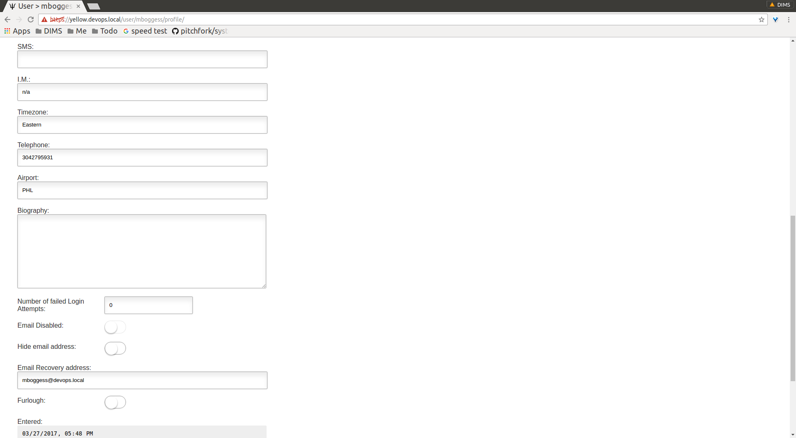
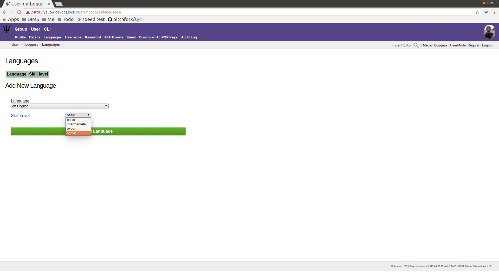
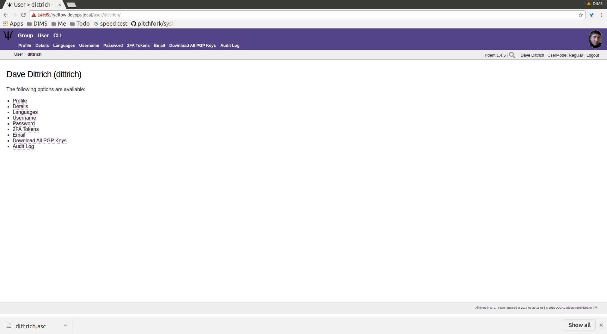
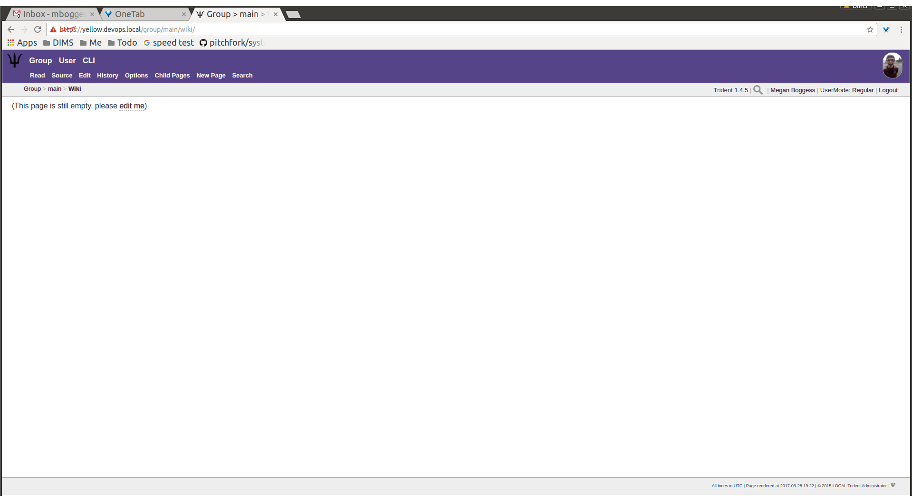

.. _memberlifecycle:

Trust Group Member Activities
=============================

This chapter serves as a training guide for members of a
trust group using a Trident portal system. It clearly
shows what activities a member may pursue and attributes she
may manage. These activities include updating a member's
profile and other personal details, managing mailing list
memberships, using the wiki, etc.

.. _usermanagement:

User Attribute Management
~~~~~~~~~~~~~~~~~~~~~~~~~

This section will cover management of a user's attributes.

Profile Management
------------------

Most of the details a regular member of a trust group can
modify about himself are found in the ``Profile`` page.
This page is accessible by clicking the ``Profile`` tab in
the second row of links at the top of the page, or the
``Profile`` link in the list of links on the user's home
page. Click either of those to get to the ``Profile`` page
that has editable attributes as can be seen in the next
three images.

.. figure:: images/trident/user-regular-shots/user-profile-1.png
       :width: 85%
       :align: center

       User profile, top

..

       User profile, middle

..

.. figure:: images/trident/user-regular-shots/user-profile-3.png
       :width: 85%
       :align: center

       User profile, bottom

..

On the profile page, details such as name, affiliation,
address, phone number, and airport can be added or modified.
A profile image can be uploaded. Longer-form attributes
can be edited, such as postal details and a biography. Failed
logins and some activity statistics are also tracked on a
member's profile.

Once a member has modified any of the editable attributes,
the ``Update Profile`` button must be clicked to save the
changes. The page will then refresh with the newly saved
information, as well as indicate how many fields were
updated and how many fields were not updated.

Other Personal Details
----------------------

Other personal details can be modified through the ``Details``,
``Languages``, and ``Username`` tabs found in the second row
at the top of any user-related page or in the list of links
found on a user's home page. We go through them all in this
section.

The ``Details`` page is a place to add any other details
that don't conform to the profile. Currently, the only
detail type is a callsign.

.. figure:: images/trident/user-regular-shots/user-details.png
       :width: 85%
       :align: center

       User details

..

The ``Languages`` page is the place to add languages a
member knows and her skill level at that language.

.. figure:: images/trident/user-regular-shots/user-languages-1.png
       :width: 85%
       :align: center

       User languages, choose language

..

       User languages, choose skill level

..

.. figure:: images/trident/user-regular-shots/user-languages-3.png
       :width: 85%
       :align: center

       User languages, updated language

..

The ``Username`` page allows a member to change her username.
This can affect external systems, so this change should be
used with care and caution. Enter the new username in the
field and use the toggle to confirm the change before
clicking the ``Change username`` button.

.. figure:: images/trident/user-regular-shots/user-username.png
       :width: 85%
       :align: center

       User username change

..

Password Change
---------------

The ``Password`` page allows a member to change her password,
provided she knows her current password (which she should,
since she is logged in already). When the member clicks the
``Change Password`` button, she is immediately logged out
and must login again, with the new password.

.. figure:: images/trident/user-regular-shots/user-password-change-1.png
       :width: 85%
       :align: center

       Define new password

..

.. figure:: images/trident/user-regular-shots/user-password-change-2.png
       :width: 85%
       :align: center

       Login with new password

..

Two Factor Authentication
-------------------------

The ``2FA Tokens`` page allows a user to add two-factor
authentication tokens. Types of two-factor authentications
include a variety of one-time passwords: time-based, HMAC-
based, and single-use. The user must give his current
password and a description for the token, as well as choose
which OTP type. Once those fields have been filled out,
click the ``Create`` button, and the new token will show
in the list of two-factor authentication tokens.

.. figure:: images/trident/user-regular-shots/user-2FA.png
       :width: 85%
       :align: center

       Two-factor authentication

..

Email Management
----------------

The ``Email`` page covers a variety of things. It lists
email addresses tied to a user's account, showing if each
email address has a PGP key tied to it, whether it is
verified, whether it is the recovery email address associated
with the user's account, and with which trust group it will
be used.

It also provides a way to add a new email address, and
lists each group and associated email addresses for that
group.

.. figure:: images/trident/user-regular-shots/user-email-1.png
       :width: 85%
       :align: center

       Main email page

..

A user can edit attributes about email addresses associated
with his account by clicking the ``Edit`` button in the row
of the email address for which the edits should be made.

       Email edit page

..

Click the ``Make Recover Email`` button to make the
selected email address the recovery email address for the
user's account.

Once this is completed, the button disappears and a check
box appears in the ``Recover`` row.

.. figure:: images/trident/user-regular-shots/user-email-3.png
       :width: 85%
       :align: center

       Make recover email

..

As can be seen, this is also the page where PGP keys are
to be added, and we will cover this in the next section.

Going back to the ``Email`` page shows another check box
in the list of email address.

.. figure:: images/trident/user-regular-shots/user-email-4.png
       :width: 85%
       :align: center

       Recover email confirmed

..

To add an email address, type it in the requested field:

.. figure:: images/trident/user-regular-shots/user-email-5.png
       :width: 85%
       :align: center

       Add new email

..

After clicking the ``Add Email Address`` button, the page
will refresh with the new address in the list at the top
of the page. Click the ``Edit`` button to make additional
changes.

.. figure:: images/trident/user-regular-shots/user-email-6.png
       :width: 85%
       :align: center

       New email attributes

..

A member must verify any new email addresses he manually adds.
Click the ``Verify`` button. This will send an email to the
provided address. The email will contain a verification code.
Copy and paste the code in the ``Verification Code`` field,
and click the ``Confirm`` button.

.. figure:: images/trident/user-regular-shots/user-email-7.png
       :width: 85%
       :align: center

       Verify email

..

Until the email address is verified, the list of email addresses
will retain an ``In Process`` status in the ``Verify`` column.

.. figure:: images/trident/user-regular-shots/user-email-8.png
       :width: 85%
       :align: center

       New email status

..

Remember, the "Edit" screen allows you to make any of your
available addresses the recovery email for your account.
Only one address may be the recovery email.

Since the ``dittrich`` user has not confirmed his new email
address yet, let's take a look at what happens when a user
does have multiple verfied email addresses.

A user can choose which email address will be associated
with each trust group of which she is a member. In the case
of the user ``mboggess``, she has two email addresses. Only
one address can be associated with a trust group at a time.
Since she has two email addresses, she must chose one to
be associated with the ``main`` trust group of which she is
a member.

       Multiple emails

..

By choosing the second email address (the @uw email address)
to be the email address associated with the ``main`` trust
group, the list at the top of the page changes. It now
shows the @uw email address is associated with the ``main``
trust group, as indicated by the ``Groups`` column in the
list.

.. figure:: images/trident/user-regular-shots/user-email-10.png
       :width: 85%
       :align: center

       Email-group association swap

..

PGP Keys
--------

PGP keys can be downloaded and uploaded. They must stay
current for a user to be able to read any encrypted email
sent via the trust groups of which the user is a member.

To download all PGP keys tied to any emails associated with
a user's account, just click the ``Download All PGP Keys``
tab in the second row at the top of any ``User`` page, or
click the ``Download All PGP Keys`` link in the list of
links on the user's home page.

       Download PGP keys

..

To add PGP keys, return to the ``Email`` page. Click the ``Edit``
button in the row of the email address of which you'd like
to associate a PGP key. In the ``PGP Key`` row, you will be
able to choose the PGP key file. Then click the ``Upload Key``
button.

.. figure:: images/trident/user-regular-shots/user-pgp-add.png
       :width: 85%
       :align: center

       Upload PGP key

..

Audit Log
---------

The ``Audit Log`` page has no editable attributes. It shows
all activities accomplished by the user.

.. figure:: images/trident/user-regular-shots/user-audit-log.png
       :width: 85%
       :align: center

       Audit log

..

Searches are possible. Additionally, only 10 activities are
shown at a time, so click the ``Forward`` button to see
older activities.

.. _usergroupmanagement:

Group Management
~~~~~~~~~~~~~~~~

This section will cover group activities and attributes a
user may view or manage.

.. _viewableattributes:

Viewable Group Attributes
-------------------------

This subsection will cover attributes viewable from the
``Member``, ``Airports``, ``Contacts``, and ``Vouches``
tabs.

First of all, to view a list of groups of which a user is a
member, click the ``Group`` tab in the top row of any page.
This presents a page listing all groups of which a user is
a member.

.. figure:: images/trident/group-regular-shots/group-main-1.png
       :width: 85%
       :align: center

       Trust group list

..

To see more information about a certain group, click one of
the links in the list.

       Trust group attributes list

..

This presents a page with a list of links to all attributes
viewable or manageable by the member. There are some activities
the member may take part in, such as nominating and vouching
for new group members, but, for the most part, a regular
member may only view these attributes. They are not allowed
to change attributes about the group or its members. One
notable exception is that members are allowed to start new
mailing lists. This activity, along with nominating and
vouching, will be covered in the next section. For now,
let's go over the attributes viewable by members.

The first link on the group home page, or the first tab in
the second row of all group-related pages is titled
``Members``. Click either the link or the tab to go to a
page listing all members in the current trust group.

       Trust group members list

..

Click on any member's username link, and you will be taken
to their profile.

.. figure:: images/trident/group-regular-shots/group-member-profile-1.png
       :width: 85%
       :align: center

       Member profile, top

..

.. figure:: images/trident/group-regular-shots/group-member-profile-2.png
       :width: 85%
       :align: center

       Member profile, middle

..

       Member profile, vouches for

..

You may view any member's profile, provided you are in
their trust group. At the bottom of the profile, there are
lists of vouching activities the current member has been
part of: vouches he has made or vouches other members have
made for him. In the above example, another user vouched for
the user ``dittrich``, but he has not yet vouched for anyone.

In this next example, the user ``trident`` has vouched
for another member, but has not yet been vouched for by
any other member. We will discuss vouching in the section
on :ref:`manageableactivities`.

.. todo::

    Where should vouching go? User section or group section?

..

       Member profile, no vouches for

..

The ``Airports`` page shows a list of airports members of
the current trust group indicate as the airport nearest to
them.

.. figure:: images/trident/group-regular-shots/group-airports.png
       :width: 85%
       :align: center

       Airports list

..

Click on any airport abbreviation in the list, and you'll
be taken to a new page with a list of members who have
indicated the airport is the airport nearest to them.

.. figure:: images/trident/group-regular-shots/group-airports-phl.png
       :width: 85%
       :align: center

       Members with PHL airport

..

.. figure:: images/trident/group-regular-shots/group-airports-sea.png
       :width: 85%
       :align: center

       Members with SEA airport

..

The ``Contacts`` page shows a list of members of the current
trust group with their contact information, including
affiliation, email, telephone, and SMS.

.. figure:: images/trident/group-regular-shots/group-contacts.png
       :width: 85%
       :align: center

       Member contact list

..

The ``Vouches`` page shows a list of all vouches made for
members of the current trust group. This list indicates who
was vouched for and by whom and on what date the vouch was
made.

If no vouches have been made yet, you'll get a mostly
blank page:

.. figure:: images/trident/group-regular-shots/group-vouches.png
       :width: 85%
       :align: center

       No vouches

..

Once at least one vouch has been made, a list will appear:

       Vouches made

..

.. _manageableactivities:

Manageable Group Activities
---------------------------

This subsection will cover attributes and activities
manageable from the ``PGP Keys``, ``Mailing List``,
``Wiki``, ``Files``, ``Nominate``, and ``Vouching Control
Panel`` tabs or links. Remember, the tabs will be found in
the second row at the top of any group-related page and the
links can be found listed on the group's main page.

The ``PGP Keys`` tab or link doesn't actually take you to a
new page, it just downloads all PGP keys for the current
trust group.

.. figure:: images/trident/group-regular-shots/group-pgp-download.png
       :width: 85%
       :align: center

       Download PGP keys

..

The ``Mailing List`` tab or links opens a new page listing
the current trust group's mailing lists and information
about them.

.. figure:: images/trident/group-regular-shots/group-mailing-list-list.png
       :width: 85%
       :align: center

       Mailing lists list

..

Clicking the link found in any row of the ``Shortname``
column will take you to a page listing members on that
mailing list. Clicking the link in any row of the ``PGP``
column will download the PGP keys for that mailing list.

.. figure:: images/trident/group-regular-shots/group-mailing-list-pgp-download.png
       :width: 85%
       :align: center

       Download list PGP keys

..

When new mailing lists are added, trust group members may
have to manually add, or subscribe, themselves to the list.
Do so by clicking the ``Subscribe`` button found in the
``Action`` column of the mailing list to which you would
like to subscribe.

       Subscribe to new mailing list

..

Likewise, to unsubscribe to a mailing list from which you
would not like to receive email, click the ``Unsubscribe``
button in the ``Action`` column of the mailing list to which
you would like to unsubscribe.

.. figure:: images/trident/group-regular-shots/group-mailing-list-unsubscribe.png
       :width: 85%
       :align: center

       Unsubscribe from mailing list

..

When you are finished viewing or managing the mailing lists,
to return to either the user or group perspective, click the
``User`` or ``Group`` tabs in the top row of the page. If
returning to a group, chose the group from the list of
available trust groups.

The ``Wiki`` tab or link opens a new page showing the wiki's
home page. The second row at the top of the page changes to
be wiki-related tabs, rather than group-related tabs.

       Wiki home page

..

If no content has been added to the wiki before, as the
above image shows, click the ``edit me`` link. This will
take you to an editor (which is also the ``Edit`` tab).
Edit as you please.

Any page you edit will have an editor similar to what is
shown in the image below. Once you have your content to your
satisfaction, make sure to add a summary in the ``Edit
Summary`` field, then click the ``Save Revision`` button.

       Wiki editor

..

Once the edit has been saved, you'll be taken back to the
wiki page you were editing, and you'll see the changes made.

.. figure:: images/trident/group-regular-shots/group-wiki-edit-made.png
       :width: 85%
       :align: center

       Wiki edit made

..

Use the ``Source`` tab to see the markdown source and its
HTML preview for the wiki home page. This page will also
give you a link to obtaining the raw markdown file.

       Wiki source

..

To see a history of edits made to the wiki, use the
``History`` tab.

.. figure:: images/trident/group-regular-shots/group-wiki-edit-history.png
       :width: 85%
       :align: center

       Wiki edit history

..

The next tab, ``Options``, pages can be moved, deleted,
and/or copied.

.. figure:: images/trident/group-regular-shots/group-wiki-options-1.png
       :width: 85%
       :align: center

       Wiki options, top

..

       Wiki options, bottom

..

The ``Child Pages`` tab lists any child pages of the wiki.
Clicking on the ``Path`` links will list any child pages of
that root page. Click the ``View`` link in the ``Action``
column to view any of the child pages. If no child pages
have been added, as is the case below, just the root paths
will be shown.

       Empty child pages

..

To add more child pages, go to the ``New Page`` tab. Name
your page, then click the ``Create New Page`` button.

.. figure:: images/trident/group-regular-shots/group-wiki-new-page.png
       :width: 85%
       :align: center

       Create a new page

..

This will take you to an editor page where you can write up
your new wiki page.

       Edit a new page

..

Once you're done editing, give a summary of the edits in the
``Edit Summary`` field, and click the ``Save Revision``
button. This will take you to a new page, showing the new
page.

       New wiki page

..

This automatically updates the list of child pages found on
the ``Child Pages`` page.

       Child pages list updated

..

You can also search through all the wiki pages available to
the current trust group.

.. figure:: images/trident/group-regular-shots/group-wiki-search.png
       :width: 85%
       :align: center

       Wiki search

..

When you are finished editing the wiki, to return to either
the user or group perspective, click the ``User`` or
``Group`` tabs in the top row of the page. If returning to a
group, chose the group from the list of available trust
groups.

The ``Files`` link or tab organizes files for the current
trust group. Members can add both directories and files,
view a list of available artifacts, and view the available
artifacts. If no files or directories have been added, the
``Files`` home page will only show two buttons, an ``Add a
new file`` button and an ``Add a new directory`` button.
Otherwise, it will show a list of available directories, as
well as the ``Add`` buttons.

.. figure:: images/trident/group-regular-shots/group-files-home-page.png
       :width: 85%
       :align: center

       Files home page

..

To add a directory, use the ``Add Directory`` tab in the
second row at the top of the page, or the ``Add a new
directory`` button from the ``Files`` home page.

To add a new directory, you must give the filepath of the
new directory and a brief description of the directory. Then
click the ``Create new directory`` button.

       Add directory

..

The home page list of directories will be updated
accordingly.

.. figure:: images/trident/group-regular-shots/group-files-home-page-dir-add.png
       :width: 85%
       :align: center

       Available directories updated

..

To add a file, click either the ``Add File`` tab or the
``Add a new file`` button from the ``Files`` home page. This
takes you to a new page where you can give the file a name,
a description, and chose the file from your local
filesystem. Then, click the ``Create new file`` button.

       Add a new file

..

Once submitted, a new page will show that the file has been
uploaded and to which path. It also gives some statistics
about the current directory and files.

.. figure:: images/trident/group-regular-shots/group-files-file-add-2.png
       :width: 85%
       :align: center

       Confirmation of a new file

..

The ``Files`` tab's home page is also updated, but it is a
little subtle when a file is added.

       Home page file add confirmation

..

The only difference is that the 'Total' count has gone up by
one. If you added a new file to the root path, the file
itself would show up, and the count would increase. Since
the added file is stored in the ``logs`` directory, it is
hidden on this page. You can click the ``Path`` link for any
subdirectories to get a list of files or more subdirectories
in that directory.

The ``List`` tab which returns you to the ``Files`` home page,
listing available directories and files.

Again, to return to group or user settings, click the ``Group``
or ``User`` tabs in the top row of the page.

.. _vouching:

Vouching for Trust Group Members
~~~~~~~~~~~~~~~~~~~~~~~~~~~~~~~~

For a user to become a member of a trust group, they must be
"vouched for" by other members of the trust group.
Essentially, this means that other members of the trust
group know the potential member and trust her with
admittance to the trust group.

Each trust group may have unique requirements about the
number of vouches a user must obtain before she will be
permitted to become a member of the trust group. For our
training guide, only one vouch is required for membership.
Most groups will have more significant requirements.

Vouching is not required only for member admittance, but it
can also be used to indicate member relationships beyond the
minimum requirement needed for membership.

There are three ways for a trust group member to vouch for
another member: vouch for a member through the member's
profile, nominate a user through the group's profile, use
the ``Vouching Control Panel``.

The first way to vouch for a member is through the member's
profile. This means the user must already be a member, and
has already been vouched for enough times to meet the
current trust group's requirements for membership.

Go to the home page of the group of the member for whom you
would like to vouch. To see what vouches have already been
made, go to the ``Vouches`` tab. Then, to start vouching for
a member, click the ``Members`` tab or link, then choose the
user. You should now be on his profile page. Scroll all the
way to the bottom of the profile, and you will see a form
section where you can write a comment about why you are
vouching for the member and make attestations about your
relationship to the member.

.. figure:: images/trident/group-regular-shots/group-vouch-1.png
       :width: 85%
       :align: center

       Member profile, blank vouch section

..

Fill in the form, then click the ``Vouch`` button.

.. figure:: images/trident/group-regular-shots/group-vouch-2.png
       :width: 85%
       :align: center

       Member profile, filled-in vouch section

..

Once you have vouched for a member, this vouch will be on
that members profile forever. You can update the vouch, or
delete it, if necessary. Additionally, vouches made by the
member are listed right above the vouches made for the
member.

       Member profile, vouch made

..

To vouch for a brand new user, you must nominate the user.
Go to the home page of the group to which the user should be
nominated. The ``Nominate`` tab brings up a page which
allows you to start the process of nominating a user to the
trust group.  First, the user must exist in the system. Then,
you can search for the user by their email address associated
with their account.

Once you have given the email in the ``Search email`` field,
click the ``Search`` button.

.. figure:: images/trident/group-regular-shots/group-nominate-1.png
       :width: 85%
       :align: center

       Search for a user to nominate

..

If there is a user tied to the given email address, the user
will show up in a list on the next page. Click the
``Select`` button to continue.

.. figure:: images/trident/group-regular-shots/group-nominate-2.png
       :width: 85%
       :align: center

       User search results

..

Part of the nomination process is a vouch for the user you
are nominating. Your trust group will have its own
requirements, but, in general, any given trust group will
require a user to obtain a certain number of vouches in
order for them to be allowed to join the trust group.

In the page that follows your selection of a user to
nominate, you are given the opportunity to vouch for them.
You may write a comment about why you are vouching for the
user, then you toggle the three attestations to confirm your
relationship to the user. Then, click the ``Nominate``
button.

       Vouch for a user

..

If the submission goes correctly, this is indicated at the
bottom of the page.

.. figure:: images/trident/group-regular-shots/group-nominate-4.png
       :width: 85%
       :align: center

       Successful nomination

..

If you return to the ``Members`` page for the current trust
group, you will see that the list of members has updated.
The user ``bob`` had previously not been on the list of
members, but now that member is there. The user's
``Vouches`` column is also automatically updated.

The final way to vouch for members is to use the ``Vouching
Control Panel`` found in a tab or link of the same name
within the group perspective. This panel allows you to
submit vouches in batches.

.. figure:: images/trident/group-regular-shots/group-vouching-ctrl-panel.png
       :width: 85%
       :align: center

       Vouching control panel

..

There are two selections you can make to form groups of
members which you can then act against all at one time.
Choose a criteria ``Unmarked``, ``Dunno``, or ``Vouched``.
``Unmarked`` means you haven't vouched for them at all.
``Dunno`` means you don't know them. ``Vouched`` means you
have vouched for them. Then choose a limit for how many
members you want to deal with at one time. Once you've
selected you criteria and limits, click the ``Change
Criteria`` button.

Once you've made your selection, you can then walk through
the batch, and apply an action against each member, by
toggling the button in the ``Action`` column. Once you've
applied all your actions, click the button at the bottom of
the list. Its name changes, depending on which action you are
applying.

Those are all the tasks a member of a trust group can
perform. To see tasks for admins of trust groups or for
system administrators, please see the other chapters in this
document.
