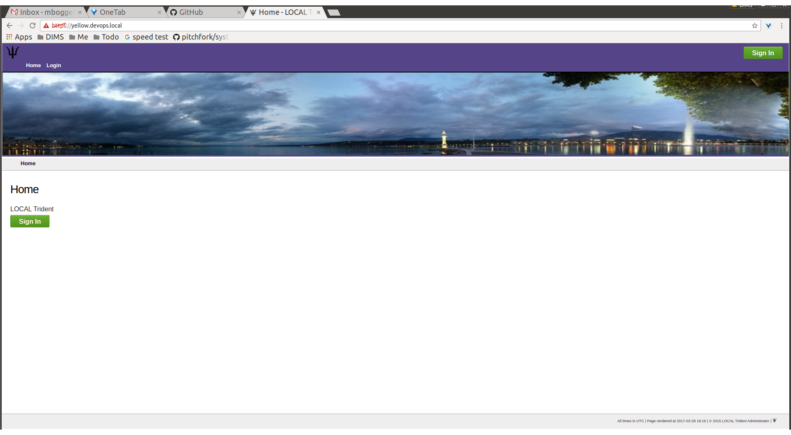
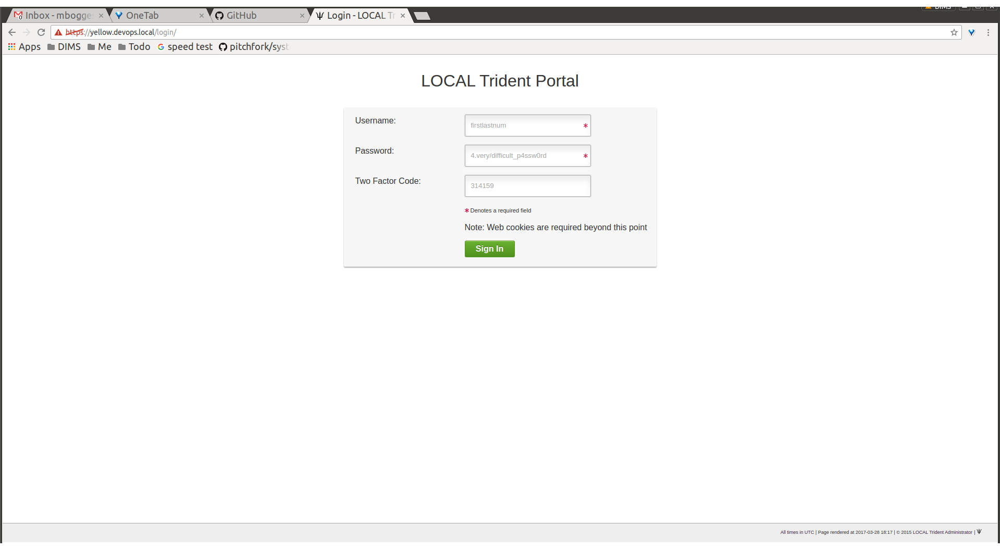
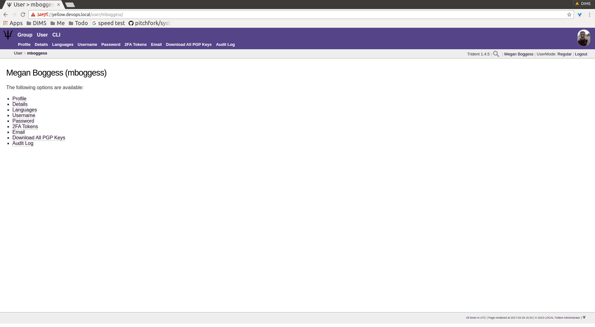
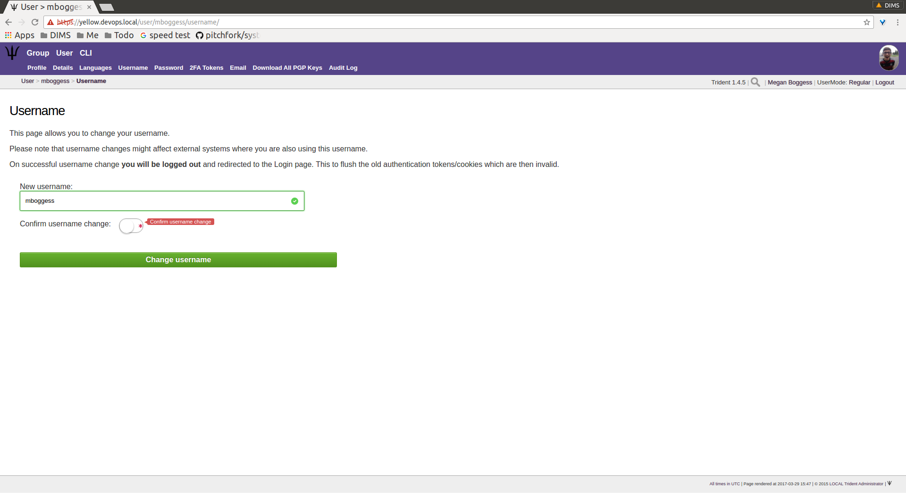

.. _memberlifecycle:

Lifecycle of a Trident Member
=============================

Introduction
------------

This chapter serves as a training guide for members of a
trust group using a Trident user portal system. It clearly
shows what activities a member may pursue and attributes she
may manage. These activities include updating a member's
profile and other personal details, managing mailing list
memberships, using the wiki, etc.

Logging in to Trident
---------------------

In order to manage a member of a Trident trust group, the
member must have access to a running Trident system. In your
web browser, navigate to the URL of the system to which you
have access. That will bring you to the following page:

       Trident home page

..

Click one of the ``Sign In`` buttons to go to the login
page:

       Trident login page

..

Enter your credentials, and click the ``Sign In`` button.
This will bring you to your user's home page, which will
look similarly to this page:

       User logged in

..

.. _usermanagement:

User Attribute Management
-------------------------

This section will cover management of a user's attributes.

Profile Management
~~~~~~~~~~~~~~~~~~

Most of the details a regular member of a trust group can
modify about himself are found in the ``Profile`` page.
This page is accessible by clicking the ``Profile`` tab in
the second row of links at the top of the page, or the
``Profile`` link in the list of links on the user's home
page. Click either of those to get to the ``Profile`` page
that has editable attributes as can be seen in the next
three images.

.. figure:: images/trident/user-regular-shots/user-profile-1.png
       :width: 85%
       :align: center

       User profile, top

..

.. figure:: images/trident/user-regular-shots/user-profile-2.png
       :width: 85%
       :align: center

       User profile, middle

..

       User profile, bottom

..

On the profile page, details such as name, affiliation,
address, phone number, and airport can be added or modified.
A profile image can be uploaded. Longer-form attributes
can be edited, such as postal details and a biography. Failed
logins and some activity statistics are also tracked on a
member's profile.

Once a member has modified any of the editable attributes,
the ``Update Profile`` button must be clicked to save the
changes. The page will then refresh with the newly saved
information, as well as indicate how many fields were
updated and how many fields were not updated.

Other Personal Details
~~~~~~~~~~~~~~~~~~~~~~

Other personal details can be modified through the ``Details``,
``Languages``, and ``Username`` tabs found in the second row
at the top of any user-related page or in the list of links
found on a user's home page. We go through them all in this
section.

The ``Details`` page is a place to add any other details
that don't conform to the profile. Currently, the only
detail type is a callsign.

.. figure:: images/trident/user-regular-shots/user-details.png
       :width: 85%
       :align: center

       User details

..

The ``Languages`` page is the place to add languages a
member knows and her skill level at that language.

.. figure:: images/trident/user-regular-shots/user-languages-1.png
       :width: 85%
       :align: center

       User languages, choose language

..

.. figure:: images/trident/user-regular-shots/user-languages-2.png
       :width: 85%
       :align: center

       User languages, choose skill level

..

.. figure:: images/trident/user-regular-shots/user-languages-3.png
       :width: 85%
       :align: center

       User languages, updated language

..

The ``Username`` page allows a member to change her username.
This can affect external systems, so this change should be
used with care and caution. Enter the new username in the
field and use the toggle to confirm the change before
clicking the ``Change username`` button.

       User username change

..

Password Change
~~~~~~~~~~~~~~~

The ``Password`` page allows a member to change her password,
provided she knows her current password (which she should,
since she is logged in already). When the member clicks the
``Change Password`` button, she is immediately logged out
and must login again, with the new password.

.. figure:: images/trident/user-regular-shots/user-password-change-1.png
       :width: 85%
       :align: center

       Define new password

..

.. figure:: images/trident/user-regular-shots/user-password-change-2.png
       :width: 85%
       :align: center

       Login with new password

..

Two Factor Authentication
~~~~~~~~~~~~~~~~~~~~~~~~~

The ``2FA Tokens`` page allows a user to add two-factor
authentication tokens. Types of two-factor authentications
include a variety of one-time passwords: time-based, HMAC-
based, and single-use. The user must give his current
password and a description for the token, as well as choose
which OTP type. Once those fields have been filled out,
click the ``Create`` button, and the new token will show
in the list of two-factor authentication tokens.

.. figure:: images/trident/user-regular-shots/user-2FA.png
       :width: 85%
       :align: center

       Two-factor authentication

..

Email Management
~~~~~~~~~~~~~~~~

The ``Email`` page covers a variety of things. It lists
email addresses tied to a user's account, showing if each
email address has a PGP key tied to it, whether it is
verified, whether it is the recovery email address associated
with the user's account, and with which trust group it will
be used.

It also provides a way to add a new email address, and
lists each group and associated email addresses for that
group.

       Main email page

..

A user can edit attributes about email addresses associated
with his account by clicking the ``Edit`` button in the row
of the email address for which the edits should be made. 

.. figure:: images/trident/user-regular-shots/user-email-2.png
       :width: 85%
       :align: center

       Email edit page

..

Click the ``Make Recover Email`` button to make the
selected email address the recovery email address for the
user's account. 

Once this is completed, the button disappears and a check
box appears in the ``Recover`` row.

       Make recover email

..

As can be seen, this is also the page where PGP keys are
to be added, and we will cover this in the next section.

Going back to the ``Email`` page shows another check box
in the list of email address.

       Recover email confirmed

..

To add an email address, type it in the requested field:

.. figure:: images/trident/user-regular-shots/user-email-5.png
       :width: 85%
       :align: center

       Add new email

..

After clicking the ``Add Email Address`` button, the page
will refresh with the new address in the list at the top
of the page. Click the ``Edit`` button to make additional
changes.

.. figure:: images/trident/user-regular-shots/user-email-6.png
       :width: 85%
       :align: center

       New email attributes

..

A member must verify any new email addresses he manually adds.
Click the ``Verify`` button. This will send an email to the
provided address. The email will contain a verification code.
Copy and paste the code in the ``Verification Code`` field,
and click the ``Confirm`` button.

       Verify email

..

Until the email address is verified, the list of email addresses
will retain an ``In Process`` status in the ``Verify`` column.

.. figure:: images/trident/user-regular-shots/user-email-8.png
       :width: 85%
       :align: center

       New email status

..

Remember, the "Edit" screen allows you to make any of your
available addresses the recovery email for your account.
Only one address may be the recovery email.

Since the ``dittrich`` user has not confirmed his new email
address yet, let's take a look at what happens when a user
does have multiple verfied email addresses.

A user can choose which email address will be associated
with each trust group of which she is a member. In the case
of the user ``mboggess``, she has two email addresses. Only
one address can be associated with a trust group at a time.
Since she has two email addresses, she must chose one to
be associated with the ``main`` trust group of which she is
a member.

.. figure:: images/trident/user-regular-shots/user-email-9.png
       :width: 85%
       :align: center

       Multiple emails

..

By choosing the second email address (the @uw email address)
to be the email address associated with the ``main`` trust
group, the list at the top of the page changes. It now
shows the @uw email address is associated with the ``main``
trust group, as indicated by the ``Groups`` column in the
list.

       Email-group association swap

..

PGP Keys
~~~~~~~~

PGP keys can be downloaded and uploaded. They must stay
current for a user to be able to read any encrypted email
sent via the trust groups of which the user is a member.

To download all PGP keys tied to any emails associated with
a user's account, just click the ``Download All PGP Keys``
tab in the second row at the top of any ``User`` page, or
click the ``Download All PGP Keys`` link in the list of
links on the user's home page.

.. figure:: images/trident/user-regular-shots/user-pgp-download.png
       :width: 85%
       :align: center

       Download PGP keys

..

To add PGP keys, return to the ``Email`` page. Click the ``Edit``
button in the row of the email address of which you'd like
to associate a PGP key. In the ``PGP Key`` row, you will be
able to choose the PGP key file. Then click the ``Upload Key``
button.

.. figure:: images/trident/user-regular-shots/user-pgp-add.png
       :width: 85%
       :align: center

       Upload PGP key

..

Audit Log
~~~~~~~~~

The ``Audit Log`` page has no editable attributes. It shows
all activities accomplished by the user. 

.. figure:: images/trident/user-regular-shots/user-audit-log.png
       :width: 85%
       :align: center

       Audit log

..

Searches are possible. Additionally, only 10 activities are
shown at a time, so click the ``Forward`` button to see
older activities.

.. _usergroupmanagement:

Group Management
----------------

This section will cover group activities and attributes a
user may view or manage.

.. _viewableattributes:

Viewable Group Attributes
~~~~~~~~~~~~~~~~~~~~~~~~~

.. todo::

    This will cover the ``Member``, ``Airports``, ``Contacts``
    and ``Vouches`` tab.

..

Manageable Group Attributes
~~~~~~~~~~~~~~~~~~~~~~~~~~~

.. todo::

    This will cover the ``PGP Keys``, ``Mailing List``
    ``Wiki``, ``Files``, ``Nominate``, and ``Vouching
    Control Panel`` tabs.

..

